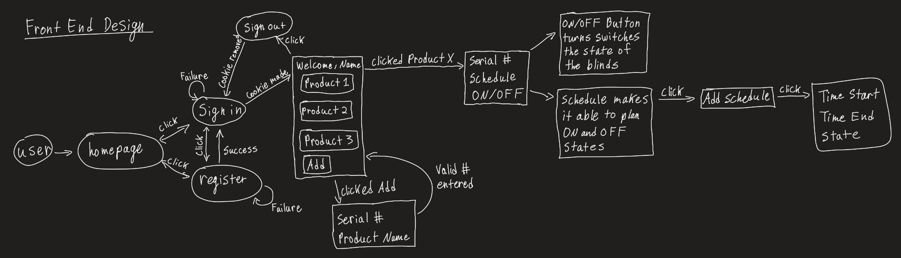
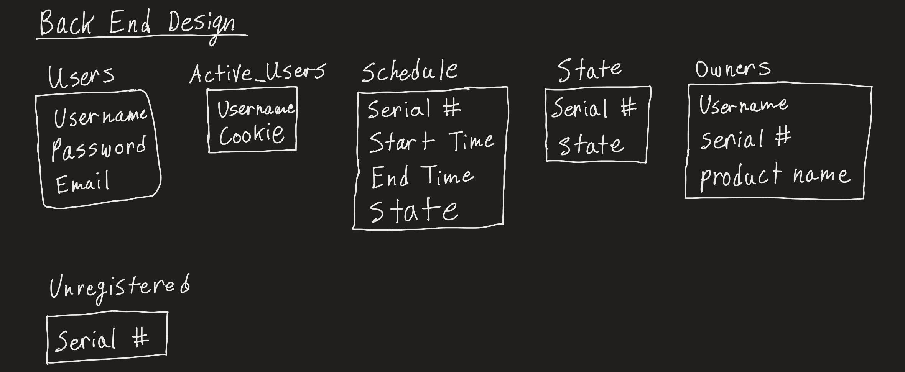
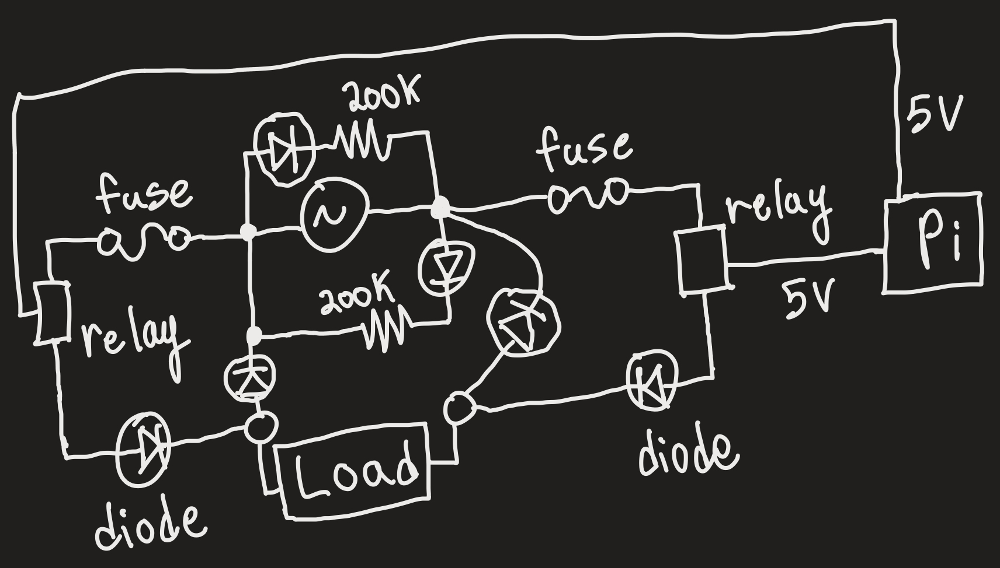
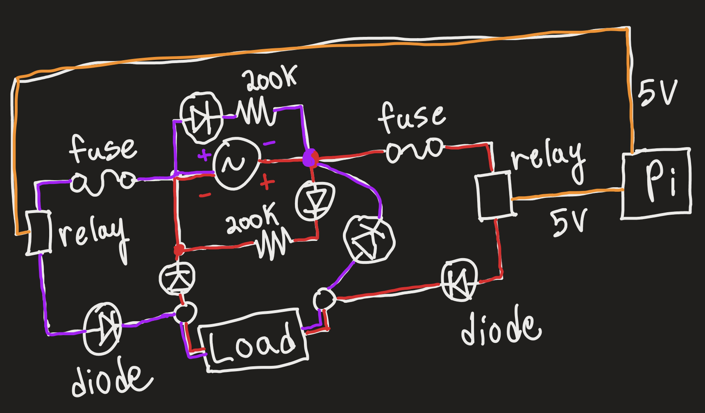
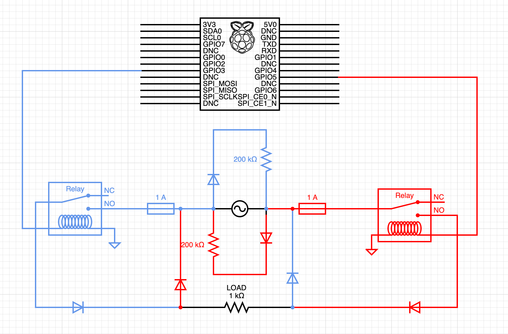
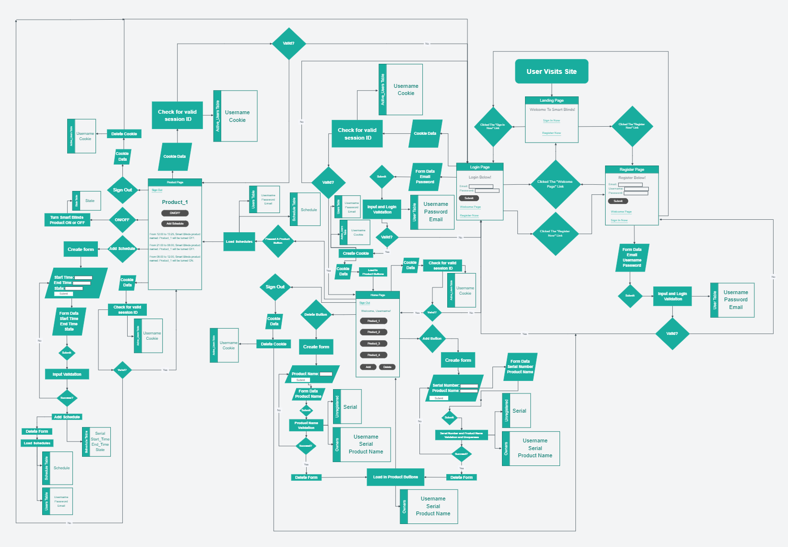

# Smart Blinds Product
ECE 140B Project by Sialoi Taa, Taimur Shaikh and Christian Hendric

## Project
This project is called the "Smart Blinds" project and the purpose of this project is to create a product that will turn ON and OFF our project via remote or via server through some customization settings.

## Front End Design - Sialoi
When going to the site to remote access their Smart Blinds product, the user must be a registered user. They will be prompted to sign in or register. Registering requires their email, a unique username and password. After completing the registration, the user will be prompted to sign in with their email and password. A valid login will relocate the user to another page that holds all of the products under that account and an "Add Product" button that will let the user add more accounts to the account. Clicking on the add product button will create a box that will create a box that will let the user add the product's serial number and a unique product name. Pressing "Submit" at the bottom of that box will allow the user to add that product to their list of products owned. Any registered product will be listed on the welcome page of the user as a button. With that will also come a delete button that will delete that product's information from that user. Clicking on that button will show that product's serial number, a schedule feature and an On/OFF button. Clicking the On/Off button will change the state of the product from clear to opaque and vice versa. Clicking on the schedule feature will enable the user to add a schedule to that product. To be able to add a schedule, the user must put in a valid time slot and the state that they wish the product to be in. Pressing the "Submit" button will add that schedule with the desired state to that product's information page. There will also be a delete button for every time slot.
  
### Front End Design Diagram - Sialoi

___
## Back End Design - Sialoi 
In the back end design, there's a *Users* table that will hold each user's name, password, email. Next will be an *Active_Users* table that will keep track who has logged in and will use the timestamp in the MySQL table to decide when to end the session (after 900 seconds). After that will be a *Schedule* table that will hold the scheduled times for the Smart Blinds product to be turned OFF or ON and the serial number of the product. Then we have the *State* table and that will tell us the state the product is in currently. The *Owners* table will hold the user's username, the product's special name and serial number. The last table we will have is the *Unregistered* table that will hold all of the unassigned Smart Blinds products that are out on the market.  
  
In the login page, the user's input will be processed and see if we have any credentials matching what was given, if not the page will reload and the user will be prompted to put in their information again (the Users and Active_Users tables are used on this page). In the registration page, the user's input will again be processed and if their input is unique then the user will now be registered. After getting past these two pages, there's two more pages left (the Users table is used on this page). Next is the home page for the user and all of their products listed under them. This page will be accessing the Active_Users, Owners and Unregistered tables depending on the user's actions. Adding a product under that account will access the Unregistered and Owners table to take the serial number off of the Unregistered table and place it under the username and product nickname inside the Owners table. Deleting a product from the account on this page will do the reverse, take the serial number from the Owners table, delete that row and add the serial number to the Unregistered table again. The Active_Users table will be accessed every 10 seconds to check to see if the session_ID has expired. Lastly, the features page is product specific, meaning that these are the features of a singular Smart Blinds product. This page will have access to the State, Schedule and Active_Users table. Every 10 seconds, the Active_Users table will be asked if the session_ID is expired yet. The user has the option of turning the product ON or OFF through the ON/OFF button and will subsequently change the State table. The last table to be interacted with is the Schedule table that will store all of the users' specific settings for timed actions. These scheduled events override current states and will change the State table as a consequence as well. 
  
### Back End Design Diagram - Sialoi

___
# NOTES FOR NEXT TIME
* You finished the landing, login, and registration page.
* You're finishing the HTML and JS integration for the home page.
* You need to add the setInterval function to keep checking the cookies
* After finishing up the Home page, get started on the Product page that will hold the customization for each individual product.
* The customization page will connect and change the Schedule and State tables accordingly and possibly add multiprocessing that will run on the server to follow the schedules.
* Look at a way for a controller to stay connected to the internet and keep getting server updates for IoT.

# NEED TO BE DONE
* ~~Make schematic~~ - Sialoi
* UI design - Taimur
* UX design - Taimur
* ~~Information architecture~~ - Sialoi
* ~~Finalize all technical capabilities for components/hardware~~ - Sialoi
* Make a general cost and profit model - Taimur
* Make a poster - Taimur
* ~~Collect components~~ - Christian
* ~~Create the circuit~~ - Sialoi
* ~~Create mock model~~ - Christian
* Assemble model - Christian
* Debugging and testing - Sialoi
* Prep live demonstration - Everyone
  
___
# USEFUL LINKS
https://stackoverflow.com/questions/10502645/serving-a-local-website-via-bluetooth-to-a-cellphone-without-using-the-internet - Taimur

https://www.diodes.com/assets/Datasheets/ds12019.pdf (1N4148 Diode) - Sialoi

https://www.brightsparkelectrician.co.uk/knowledge-centre/sockets/which-fuse-do-i-use/#:~:text=The%20simple%20calculation%20is%20watts,or%20even%2013%20amp%20fuse. (How to use a fuse and pick one out) - Sialoi

https://www.amazon.com/HiLetgo-Channel-optocoupler-Support-Trigger/dp/B00LW15A4W/ref=asc_df_B00LW15A4W/?tag=hyprod-20&linkCode=df0&hvadid=198090929431&hvpos=&hvnetw=g&hvrand=1857119024715381207&hvpone=&hvptwo=&hvqmt=&hvdev=c&hvdvcmdl=&hvlocint=&hvlocphy=9031300&hvtargid=pla-348614466893&psc=1 (Relay Component) - Sialoi

https://byjus.com/question-answer/a-fuse-is-always-connected-in-the-live-wire-of-the-circuit-explain-the-reason/ (More fuse knowledge) - Sialoi

___
# SCHEMATIC - Sialoi
## Components
1. 1N4148 Diode (6) [uxcell® 20 Pcs 1N4148 DO-35 Fast Switching Signal Diodes 100V 500mA](https://www.amazon.com/dp/B0173B5G8E?psc=1&ref=ppx_yo2ov_dt_b_product_details)
2. 1M Ohm Resistors (2) [Makerspace on campus]
3. Fuse (2) # Need to find out the load current going through the circuit. [Techman - Pack of 5-100mA (0.1A) Glass Fuse (GMA), 250v, 5mm x 20mm (3/16" X 3/4") Fast Blow (Fast Acting)](https://www.amazon.com/gp/product/B074KMJHJS/ref=ewc_pr_img_1?smid=AUL3C4WVGKX82&psc=1)
4. Relay (2) # Need to find the working current. Look at the power (Watts) delivered by the charger, divide that by the volts (25V), add 10% to that value and you'll get the current that should be tolerated by the fuse and relay. [Songhe DC 1 Channel Optocoupler 3V/3.3V Relay High Level Driver Module Isolated Drive Control Board 3V/3.3V Relay Module for Arduino (Pack of 5)](https://www.amazon.com/gp/product/B07XGZSYJV/ref=ewc_pr_img_1?smid=A38CU2XC1RY0BO&psc=1)
  
## Visuals

## Explanation
Here's how the circuit works. First it's good to explain what each component is. The fuse circuit element is an component that is in place to protect the relay from any damage from too much current being passed through it. The fuse is designed to burnout and shutdown that part of the circuit if it detects too much current for the relay to handle. The relay is a voltage controlled switch that can be turned ON or OFF by placing 5V of DC on it. Next are the diodes which are there to control the flow of electricity. We need them there to control the overall flow of current and expectations that we've placed on the circuit. Lastly are the Pi and the resistors which have no need for explanation here.  

Now is time for the explanation for how the circuit will behave. Look at the multi-colored schematic. When focusing on the red line, we've chosen that the voltage source will have a negative on the left side and a positive on the right side. The positive side will have 3 ways to go: up, down or right. Up is blocked by a diode, down leads to a highly resistant but passable pathway to the negative of the voltage source, and right will lead to a fuse that will determine if the current is too much to a relay that will act as a switch for when we want the circuit to be complete or not, going into the smart blinds product that I've labeled as "Load". After going through the load, the current go up or left. Left is blocked by a diode but up allows for a slight voltage drop and then into possibly a resistor to control the current and leftover voltage. The purple pathway follows the same logic as the red but assumes that the voltage source will have the positive on the left side and the negative side on the right side.  

Using the Pi, we'll be able to control the switches from afar.
___
## Information Architecture - Sialoi
Below is the information architecture for Smart Blinds front and back end design integration. It will show what decisions are possible for the user and how each of those options will be interacting with the MySQL tables in the specified database.   
  
Click link for more a closer https://mockittapp.wondershare.com/flow/Gmr5MJvBrvmftlizHHd4vP
___
# TODO LIST
- Run tests on the product
- Figure out the IoT component